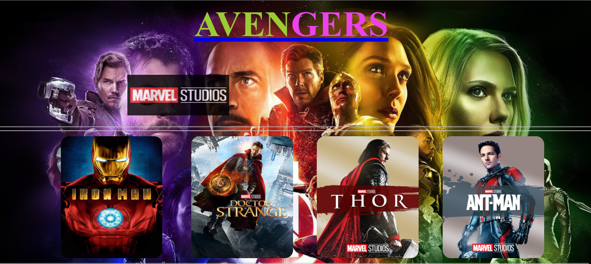
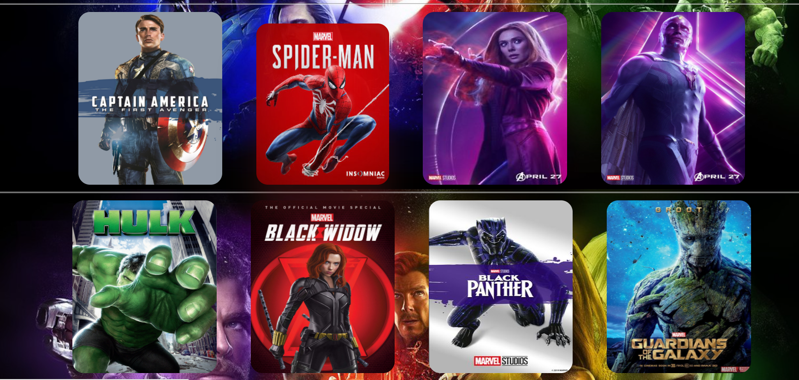
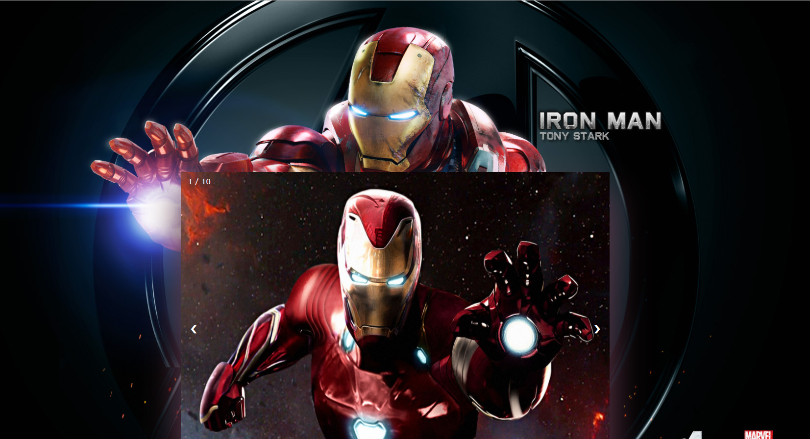
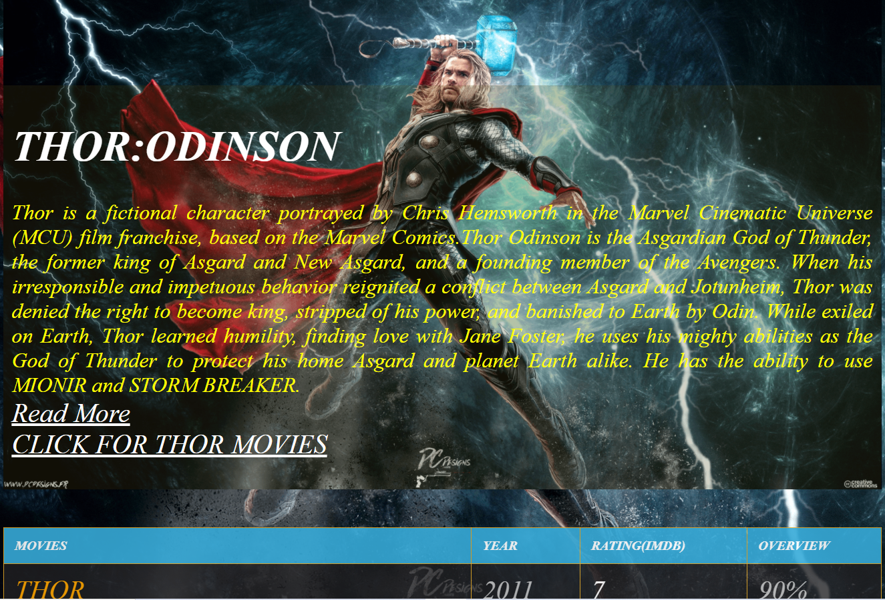
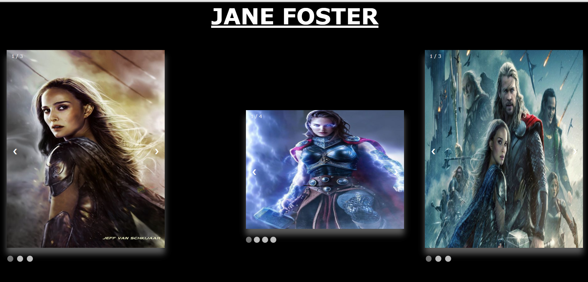
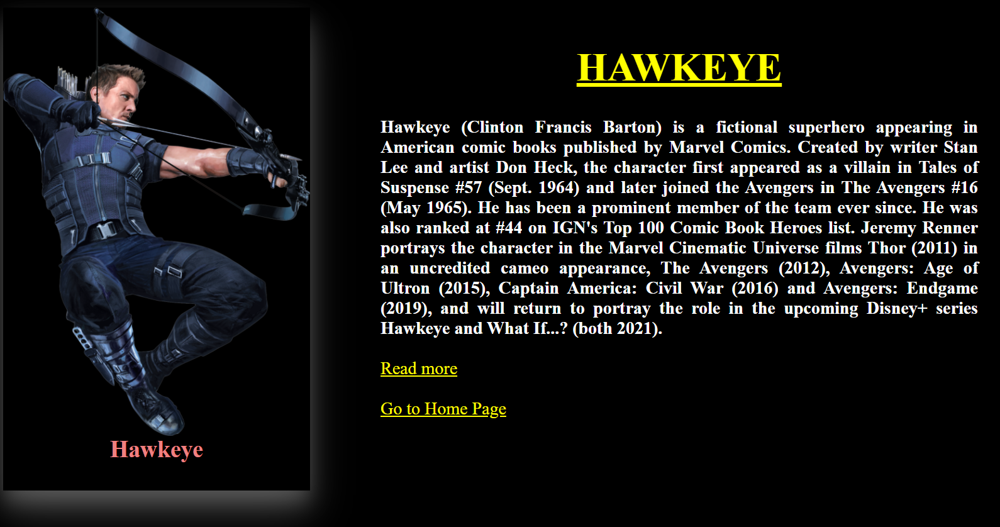
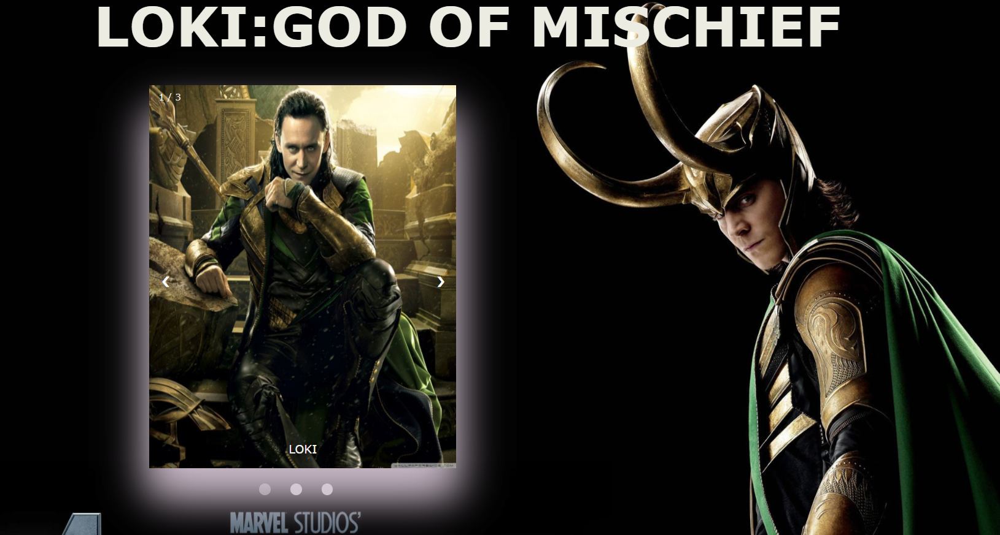

# BASIC-AVENGERS :star_struck: :open_mouth: :sunglasses: :facepunch:

[](https://shields.io/) [](https://shields.io/) [](https://shields.io/)

***This new Web application is created by Biswarup Bhattacharjee, student of BTECH, in University of Engineering and Management, Kolkata.***

**Email Id: bbiswa471@gmail.com.**

**Contact No: 916290272740.**


<p align="left">
<a href="https://www.facebook.com/profile.php?id=100070395300810" target="blank"></a>
<a href="https://instagram.com/biswarup2210" target="blank"></a>
<a href="https://github.com/biswa2210/biswa2210" target="blank"></a>
</p>

## About :point_down:

<div align="justified">
     
**:heart_eyes:Avengers' fans will love this!!!:heart_eyes:**
The Avengers were a team of extraordinary individuals, with either superpowers or other special characteristics. Its purpose was to protect global stability from inner or extraterrestrial threats. Though primarily affiliated with the United States of America, they worked with the peaceful interests of the whole world in mind rather than a specific country or organization. The Avengers were first assembled by S.H.I.E.L.D. Under Captain America's leadership, the team completed several operations around the world with success. The story evolves till Thanos and his army had followed them, sparking the immense Battle of Earth, where Iron Man gave his life to defeat Thanos and his army. With the battle won and over, the Avengers disbanded. **This web application contains 52 web pages on avengers characters including heroes and villains. Marvel studious' animation is played at the beginning. Each pages contains different designs.**
</div>

## AVENGERS WEBSITE DEMO VIDEO: :point_right: <a href="https://www.youtube.com/watch?v=LmX-UMrx1pQ&list=PL0lbDlMJ1h4hASHfEE-4cMS7CHRgtoxH5&index=14">Click here to watch</a>

## WEB DEV PLAYLIST: :point_right: <a href="https://www.youtube.com/watch?v=8_QAOpUdaIY&list=PL0lbDlMJ1h4hASHfEE-4cMS7CHRgtoxH5">Click here to watch</a>

***LINK : :point_right:https://biswa2210.github.io/BASIC-AVENGERS/.***

### Types of characters of avengers :point_down:
 - [x] 'Heroes'
 - [x] 'Villains'

<div align="left">
     
<details>
     <summary>"Click to view heros' names"></summary>
 - IRONMAN<br>
 - DOCTOR STRANGE<br>
 - THOR<br>
 - ANTMAN<br>
 - CAPTAIN AMERICA<br>
 - SPIDER MAN<br>
 - SCARLETT WITCH<br>
 - VISION<br>
 - HULK<br>
 - BLACK WIDOW<br>
 - BLACK PANTHER<br>
 - GROOT<br>
 - STAR LORD<br>
 - DRAX<br>
 - GAMORA<br>
 - NICK FURY<br>
 - WARMACHINE<br>
 - NEBULA<br>
 - WINTER SOLDIER<br>
 - HAWKEYE<br>
 - ROCKET<br>
 - CAPTAIN MARVEL<br>
 - PEPPER POTTS<br>
 - AGENT CARTER<br>
 - JANE FOSTER<br>
 - MARIA HILL<br>
 - VALKYRE<br>
 - WASP<br>
 - FALCON<br>
 - MANTIS<br>
 - WONG<br>
 - ANCIENT ONE<br>
 - HEIMDAL<br>
 - ODIN<br>
 - HOWARD STARK<br>
 - EITRI<br>
 </details>
 
 </div>
 
 <div align="left">
     
<details>
     <summary>"Click to view villains' names"></summary>
 - LOKI<br>
 - MYSTERIO<br>
 - HELA<br>
 - ULTRON<br>
 - SURTUR<br>
 - EXTREMIS<br>
 - IVAN VANKO<br>
 - RONAN<br>
 - PROXIMA MIDNIGHT<br>
 - CORVUS GLAIVE<br>
 - BLACK DWARF<br>
 - EBONY MAW<br>
 - GRAND MASTER<br>
 - RED SKULL<br>
 - OBEDIAH<br>
 - THANOS<br>
 
 </details>
 
 </div>
  
 
 
 

## Purpose :point_down:

<div align="justified">

We all know how kids are crazy about superheroes and how they fascinate themselves to be one of them. Avengers is a team of superheroes from the Marvel Universe in the Marvel’s Comic series. There are many Avengers like Iron Man, Doctor Strange, Hulk, Spider-Man, Black Widow, Thor and many others who aimed to save the universe from evils and villains like Thanos, Ultron and Loki. So I have made this for those fans and also who want to know about them.
</div>

## Use :point_down:

<div align="justified">
     
The fans of mcu AVENGERS always want to explore about characters and the film series. So it is a great chance for them to easily and also explore the world of avengers very fast and efficiently without searching in google or any social media. :superhero_man: :superhero_woman: :supervillain:
</div>

## Importance :point_down:

<div align="justified">
     
The Marvel Cinematic Universe is a media franchise created by Marvel Studios, set primarily in a shared universe designated as the reality Earth-199999 within Marvel's multiverse system, with some installments also set in adjacents or branching realities. Starting with Iron Man, the franchise is comprised mainly of films independently made by Marvel Studios, that are primarily set within this same universe, much like Marvel has done with their comics. The franchise includes a series of short films, called Marvel One-Shots, launched with each film's Blu-ray release starting with Thor and finishing with Thor: The Dark World. There are worldwide fans of avengers in marvel comics and also in hollywood cinemas. I have assembled all details and various interesting things about Avengers characters and films. So, it is a good way to explore marvel comics for the worldwide fans very easily. Without spending much time user can know many interesting facts about avengers. User can also watch movies through the links provided.
</div>

## Folder Structure :point_down:
```bash
BASIC-AVENGERS
     ├── heros
     |     └── All html, css, js files of heros(96 files)
     ├── villains
     |     └── All html, css, js files of villains(35 files)
     ├── images
     |     └── All images in each character's folder
     ├── marvel.html
     ├── marvel.css
     ├── index.html
     ├── index.css
     └── images of 82 characters and background image
```
# Making :point_down:

<div align="justified">
     
I have used basic concepts of web development to make this web application. I have used HTML5, CSS3 and JAVASCRIPT only. I have used slider, card, polaroid, table, figure, row column concepts for designing. I have used animations for text, slideshow designing.

*I have used _[marvel fandom wiki]_ (https://marvelcinematicuniverse.fandom.com/wiki/Marvel_Cinematic_Universe) for references of every avengers' characters.*

*In the home page in marvel studious I have used this link for _[avengers' bio]_(https://www.marvel.com/characters).*

*I have used _[hotstar]_(https://www.hotstar.com/in) for movie links.*

</div>
     
## Screenshots :point_down: 
<div align="center">
<a href="pics/s1.png"></a> <a href="pics/s2.png"></a>

<a href="pics/s3.png"></a> <a href="pics/s4.png"></a>

<a href="pics/s5.png"></a> <a href="pics/s6.png"></a>

<a href="pics/s7.png"></a> <a href="pics/s8.png"></a>

<a href="pics/s9.png"></a> <a href="pics/s10.png"></a>
</div>
