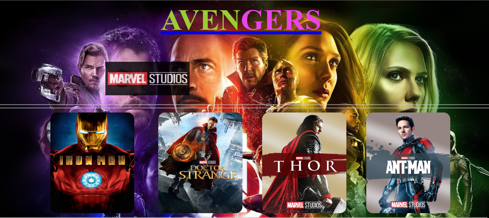
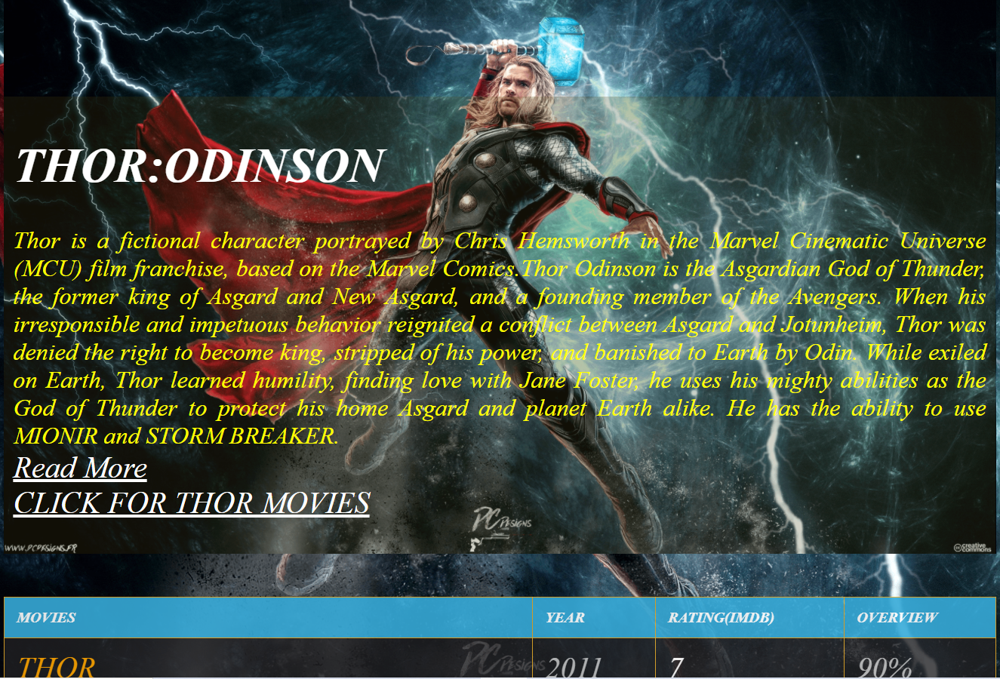

# BASIC-AVENGERS
## This new Web application is created by Biswarup Bhattacharjee, student of BTECH, in University of Engineering and Management, Kolkata.
## Email Id: bbiswa471@gmail.com. 
## Contact No: 916290272740. 
## About 
The Avengers were a team of extraordinary individuals, with either superpowers or other special characteristics. Its purpose was to protect global stability from inner or extraterrestrial threats. Though primarily affiliated with the United States of America, they worked with the peaceful interests of the whole world in mind rather than a specific country or organization. The Avengers were first assembled by S.H.I.E.L.D. Under Captain America's leadership, the team completed several operations around the world with success. The story evolves till Thanos and his army had followed them, sparking the immense Battle of Earth, where Iron Man gave his life to defeat Thanos and his army. With the battle won and over, the Avengers disbanded. This web application contains 52 web pages on avengers characters including heroes and villains. Marvel studious' animation is played at the beginning. 
## LINK : https://biswa2210.github.io/BASIC-AVENGERS/.
## Purpose
We all know how kids are crazy about superheroes and how they fascinate themselves to be one of them. Avengers is a team of superheroes from the Marvel Universe in the Marvel’s Comic series. There are many Avengers like Iron Man, Doctor Strange, Hulk, Spider-Man, Black Widow, Thor and many others who aimed to save the universe from evils and villains like Thanos, Ultron and Loki. So I have made this for those fans and also who want to know about them.
## Use
The fans of mcu AVENGERS always want to explore about characters and the film series. So it is a great chance for them to easily and also explore the world of avengers very fast and efficiently without searching in google or any social media. 
## Importance
I have assembled all details and various interesting things about Avengers characters and films. So, it is a good way to explore marvel comics for the worldwide fans very easily. Without spending much time user can know many interesting facts about avengers. User can also watch movies through the links provided.
# MAKING
I have used basic concepts of web development to make this web application. I have used HTML5, CSS3 and JAVASCRIPT only. 
## Screenshots 

